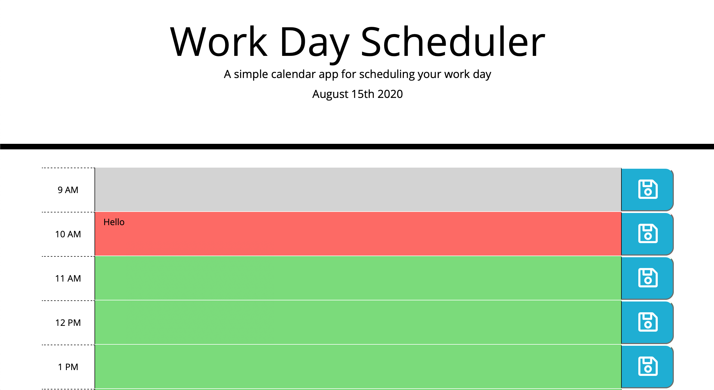

# Day Planner

## Summary

A single work day planner that will save events for a certain hour. The planner will display whether a time block is in the past, present or future.

## How To Use

The website displays the present day and work hours (9 AM to 5 PM). Each hour is a text field that can record your plans. To keep your plans from being erase, you must press the save button. The save button will allow your plan to be uploaded and displayed the next time you use the planner. The time blocks will change color based on the time: grey is the past, red is the present, and green is the future.

## Demo

### Technology Used:

- HTML
- CSS
- JavaScript
- jQuery

### Links

Deployed URL: https://kpegeder.github.io/day-planner/

GitHub Repository URL: https://github.com/kpegeder/day-planner

### Lincense - MIT
